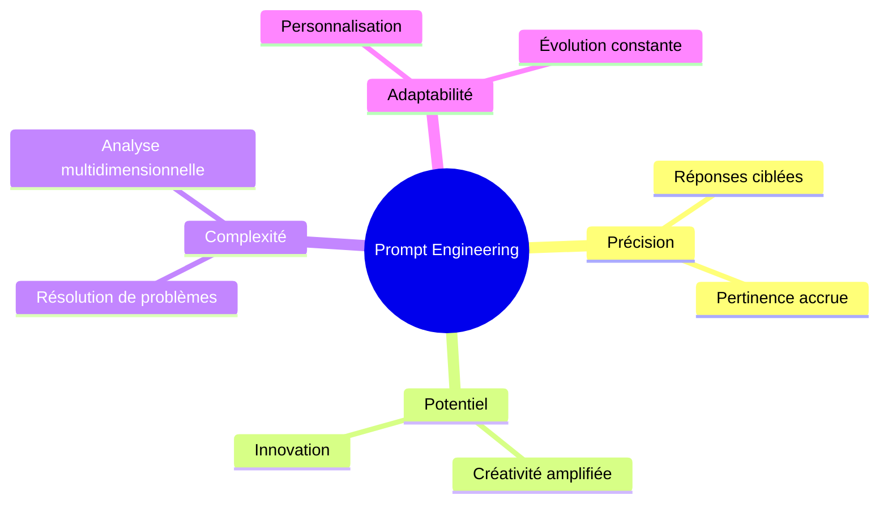
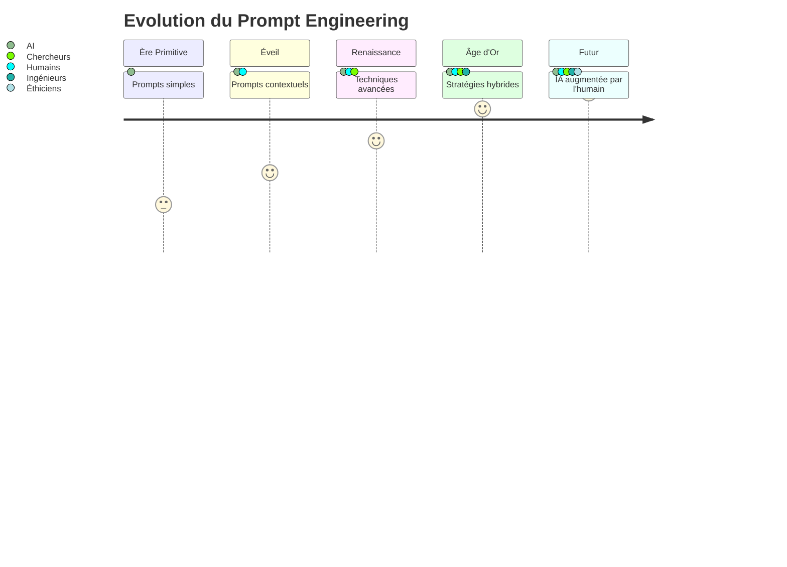
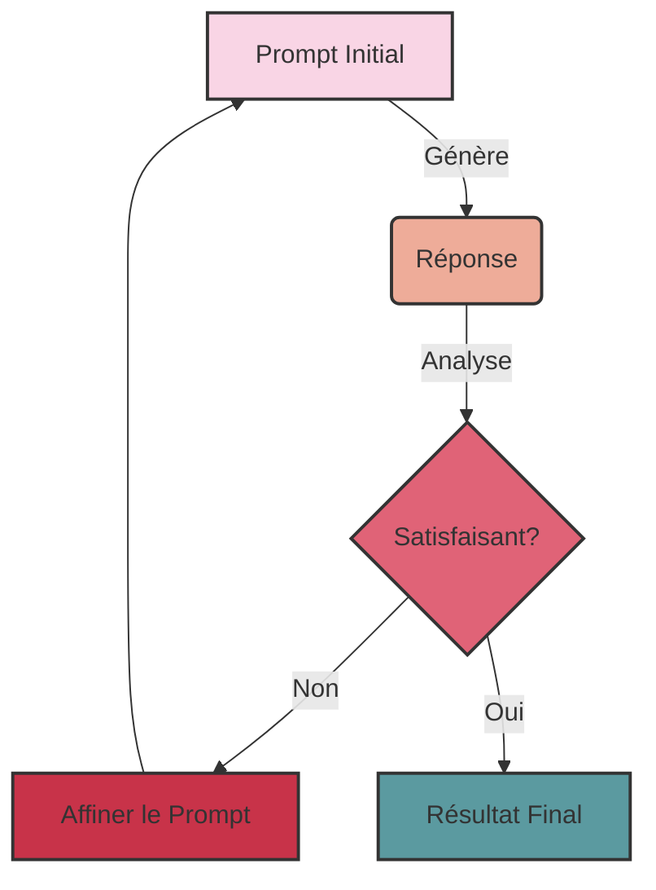
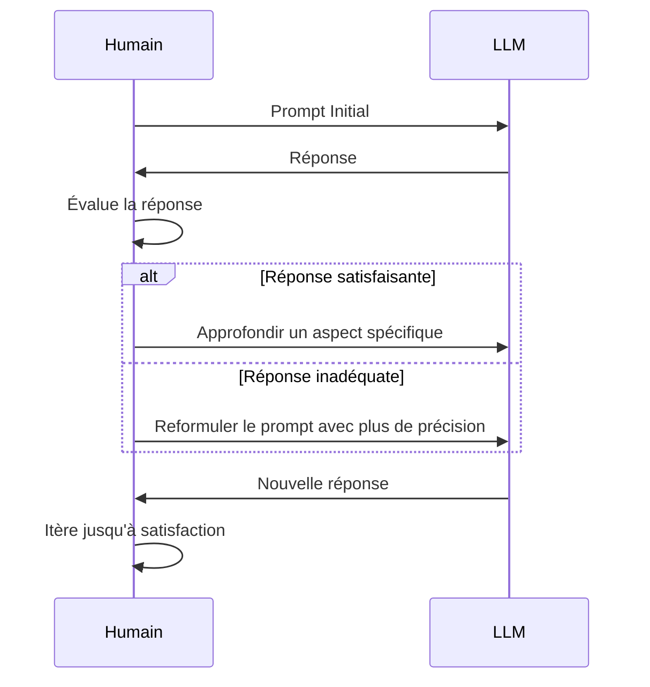
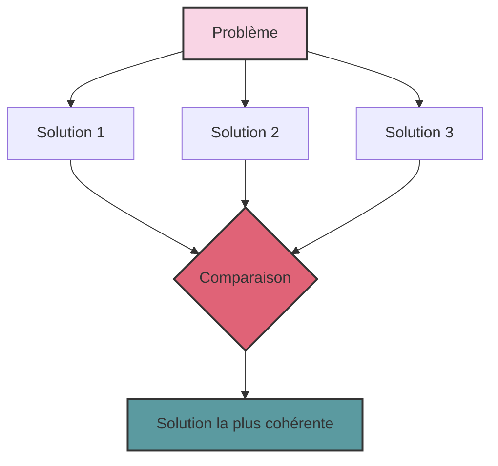
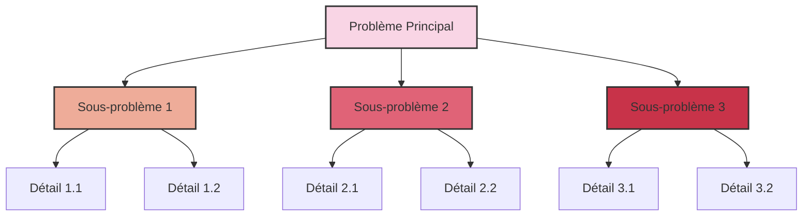
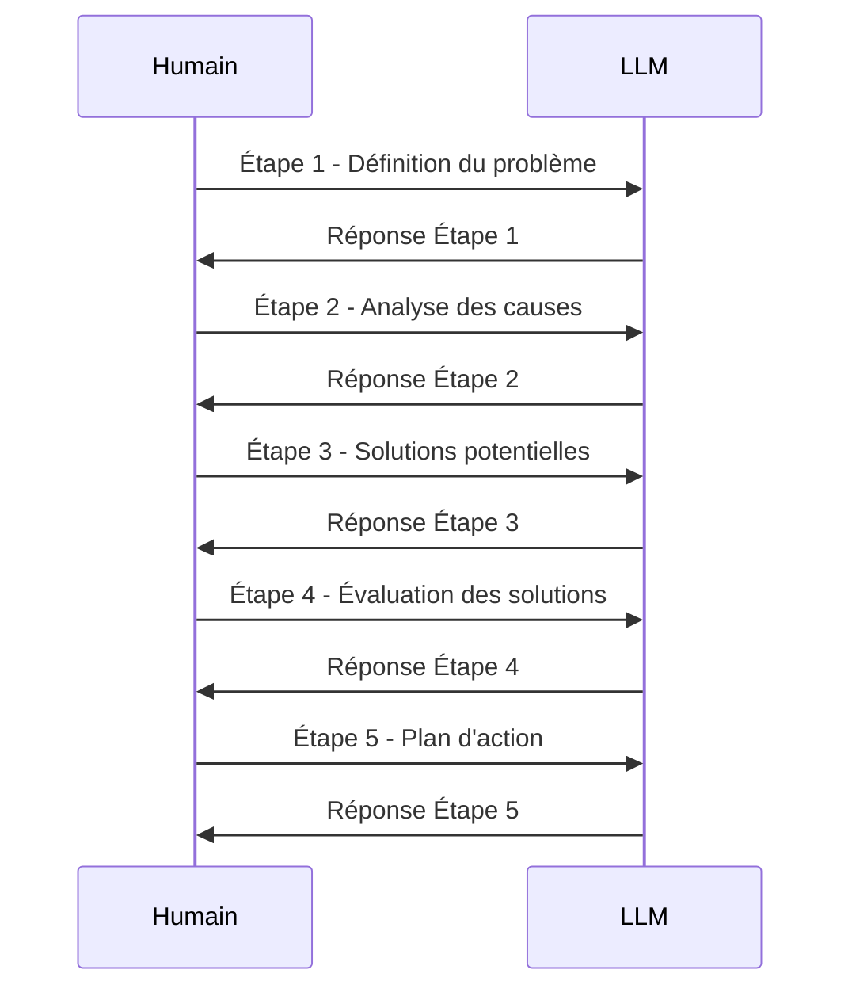

<div align="center">


# 🧠💬 L'Art du Prompt Engineering : Maîtriser les LLMs

[](https://www.alkimi.art)
[](https://daringfireball.net/projects/markdown/)
[](https://obsidian.md/)

</div>

> 🌟 Plongez dans l'univers fascinant du prompt engineering et libérez tout le potentiel des modèles de langage (LLMs). De novice à expert, découvrez comment façonner l'intelligence artificielle pour répondre à vos besoins les plus complexes.

## 📚 Table des Matières

1. [🌠 Introduction](#-introduction)
2. [🎯 Optimisation des Prompts](#-optimisation-des-prompts)
3. [🚀 Techniques Avancées](#-techniques-avancées)
4. [🧩 Combinaisons et Stratégies Hybrides](#-combinaisons-et-stratégies-hybrides)
5. [💡 Exemples Pratiques](#-exemples-pratiques)
6. [🔮 Conclusion et Perspectives](#-conclusion-et-perspectives)

## 🌠 Introduction

Le prompt engineering n'est pas qu'une simple technique, c'est un art qui repousse les frontières de l'interaction homme-machine. Dans ce guide, nous explorerons comment sculpter des instructions précises pour guider les LLMs vers des sommets de créativité et d'efficacité.

### Pourquoi le Prompt Engineering est-il révolutionnaire ?

<div align="center">



</div>

### L'évolution fascinante du Prompt Engineering

<div align="center">



</div>

## 🎯 Optimisation des Prompts

Maîtriser l'art du prompt engineering, c'est comme apprendre à diriger un orchestre symphonique. Chaque mot, chaque nuance compte. Voici les clés pour composer des prompts qui résonnent :

### 1. 🔍 Clarté Cristalline
Imaginez que vous parlez à un génie littéral. Soyez précis, concis, et sans ambiguïté.

**Avant** : "Parle-moi de l'économie"
**Après** : "Analyse l'impact de l'inflation sur le pouvoir d'achat des ménages français en 2023, en te concentrant sur les secteurs les plus touchés"

### 2. 🌍 Contextualisation Riche
Donnez à votre LLM les lunettes appropriées pour voir le monde comme vous le souhaitez.

**Exemple** : "En tenant compte de la récente pandémie, des tensions géopolitiques en Europe de l'Est, et de la transition énergétique mondiale, analyse les perspectives économiques de la France pour les 5 prochaines années"

### 3. 🔄 Itération Intelligente
Chaque réponse est une opportunité d'affiner votre approche. Pensez comme un sculpteur, affinant progressivement votre œuvre.

<div align="center">



</div>

### 4. 📊 Décomposition Stratégique
Pour les tâches complexes, adoptez une approche diviser pour mieux régner.

**Exemple** :
1. "Identifie les 5 principales industries affectées par l'inflation en France"
2. "Pour chaque industrie, analyse l'impact sur les consommateurs"
3. "Propose des stratégies d'adaptation pour chaque secteur"

### 5. ⚖️ Validation Croisée
Ne vous fiez pas à une seule réponse. Triangulез l'information pour une fiabilité accrue.

**Prompt** : "Génère trois analyses indépendantes de l'impact du télétravail sur la productivité des entreprises. Ensuite, compare et contraste ces analyses pour identifier les points de convergence et de divergence"

### 6. 🧠 Adaptation au Modèle
Chaque LLM a sa personnalité. Apprenez à parler son langage.

**Exemple pour GPT-4** : "En utilisant ta capacité d'analyse multidimensionnelle, évalue l'impact environnemental, économique et social de la transition vers les véhicules électriques en Europe"

### 7. 💬 Feedback Explicite
Guidez votre LLM vers l'excellence en lui demandant de s'auto-évaluer.

**Prompt** : "Après avoir fourni ton analyse, évalue la fiabilité de tes sources, identifie les potentiels biais dans ton raisonnement, et suggère des domaines nécessitant une recherche plus approfondie"

### 8. 🔧 Ajustement Dynamique
Soyez prêt à pivoter en fonction des réponses reçues.

<div align="center">



</div>

### 9. 🎭 Utilisation de Métaphores
Les analogies peuvent simplifier des concepts complexes et stimuler la créativité.

**Prompt** : "Explique le fonctionnement de la blockchain comme si c'était un livre de comptes partagé dans une colocation étudiante"

### 10. 🎨 Contraintes Créatives
Parfois, les limites stimulent l'innovation.

**Prompt** : "Propose une solution innovante à la pollution plastique des océans en t'inspirant uniquement des principes de la biomimétique"

### 11. 👥 Perspective Multiple
Encouragez une analyse sous différents angles pour une compréhension holistique.

**Prompt** : "Analyse l'impact de l'intelligence artificielle sur l'emploi du point de vue d'un PDG, d'un employé de bureau, d'un étudiant en informatique, et d'un éthicien"

### 12. ⏪ Raisonnement Inverse
Parfois, partir de la fin peut éclairer le chemin.

**Prompt** : "Imaginons qu'en 2050, la pauvreté mondiale a été réduite de 90%. Décris rétrospectivement les étapes et innovations clés qui ont permis d'atteindre cet objectif"

## 🚀 Techniques Avancées

Plongeons dans les techniques de pointe qui transformeront vos interactions avec les LLMs en véritables symphonies d'intelligence.

### 1. 🔗 Chain-of-Thought (CoT)

<div align="center">


</div>

**Description** : Guidez le LLM à travers un processus de réflexion pas à pas, comme un détective résolvant une énigme.

**Utilisation** : Idéale pour les problèmes complexes nécessitant un raisonnement multi-étapes.

**Exemple** :
```
Q: Un train parcourt 150 km en 2 heures. Quelle est sa vitesse moyenne en km/h ?

R: Réfléchissons étape par étape :
1. Nous connaissons la distance : 150 km
2. Nous connaissons le temps : 2 heures
3. La formule de la vitesse moyenne est : vitesse = distance / temps
4. Appliquons la formule : 150 km / 2 heures = 75 km/h

Donc, la vitesse moyenne du train est de 75 km/h.
```

### 2. 💻 Program of Thoughts (PoT)

**Description** : Transformez le raisonnement en un pseudo-code exécutable, comme un algorithme de pensée.

**Utilisation** : Particulièrement efficace pour les problèmes mathématiques ou logiques complexes.

**Exemple** :
```python
def calculer_vitesse_moyenne(distance, temps):
    return distance / temps

distance = 150  # km
temps = 2  # heures
vitesse = calculer_vitesse_moyenne(distance, temps)
print(f"La vitesse moyenne du train est de {vitesse} km/h")
```

### 3. 🔄 Self-Consistency

<div align="center">



</div>

**Description** : Générez plusieurs chemins de raisonnement et sélectionnez le plus cohérent, comme un conseil d'experts internes.

**Utilisation** : Améliore la fiabilité sur des tâches complexes ou ambiguës.

**Exemple** :
```
Problème : Évaluez l'impact du réchauffement climatique sur la biodiversité marine.

Approche 1 : [Détaillez un premier raisonnement]
Approche 2 : [Détaillez un deuxième raisonnement]
Approche 3 : [Détaillez un troisième raisonnement]

Analyse comparative : [Comparez les trois approches]
Conclusion : [Choisissez et justifiez l'approche la plus cohérente]
```

### 4. 📊 Chain-of-Table

**Description** : Structurez le raisonnement sous forme de tableau pour une analyse systématique.

**Utilisation** : Optimale pour l'analyse de données structurées ou les questions basées sur des tableaux.

**Exemple** :

| Étape | Action | Résultat | Implication |
|-------|--------|----------|-------------|
| 1 | Identifier les espèces menacées | Liste de 10 espèces | Priorité de conservation |
| 2 | Analyser les causes de déclin | Surpêche, pollution | Nécessité de régulation |
| 3 | Évaluer l'impact économique | Perte de $1B/an | Urgence d'action |
| 4 | Proposer des solutions | Zones protégées, quotas | Plan d'action concret |

### 5. 🔍 Three-Hop Reasoning (THOR)

<div align="center">

</div>

**Description** : Décomposez l'analyse en trois étapes distinctes pour une compréhension approfondie.

**Utilisation** : Efficace pour l'analyse de sentiments et les tâches de compréhension nuancée.

**Exemple** :
1. **Identification** : Le texte traite principalement de l'impact des réseaux sociaux sur la santé mentale des adolescents.
2. **Analyse** : Les termes utilisés comme "addiction", "anxiété" et "dépression" suggèrent une corrélation négative entre l'usage intensif des réseaux sociaux et le bien-être mental.
3. **Conclusion** : L'étude indique un impact globalement négatif des réseaux sociaux sur la santé mentale des adolescents, nécessitant des stratégies d'utilisation plus saines et une sensibilisation accrue.

### 6. 🌍 Context-Aware Prompting

**Description** : Adaptez le prompt en fonction du contexte spécifique de la tâche ou du domaine, comme un caméléon linguistique.

**Utilisation** : Améliore la précision en intégrant des informations contextuelles pertinentes.

**Exemple** :
```markdown
Contexte : Analyse d'un rapport financier trimestriel d'une entreprise technologique en période de récession économique.

Prompt : En tenant compte du ralentissement économique actuel et des défis spécifiques au secteur technologique (pénurie de puces, régulations sur la vie privée), analysez les points suivants du rapport trimestriel de TechCorp :
1. Croissance des revenus par rapport aux prévisions du marché
2. Stratégies d'adaptation à la récession mises en place
3. Investissements en R&D et leur potentiel impact à long terme
4. Santé de la chaîne d'approvisionnement
5. Perspectives pour le prochain trimestre
```

### 7. 🌳 Hierarchical Prompting

<div align="center">



</div>

**Description** : Structurez le prompt en niveaux hiérarchiques pour aborder des problèmes complexes de manière organisée.

**Utilisation** : Efficace pour décomposer des tâches complexes en sous-tâches gérables.

**Exemple** :
```markdown
Niveau 1: Analysez l'impact du changement climatique sur l'agriculture mondiale
  Niveau 2.1: Effets sur les principales cultures céréalières
    Niveau 3.1: Impact sur le blé
    Niveau 3.2: Impact sur le riz
    Niveau 3.3: Impact sur le maïs
  Niveau 2.2: Conséquences sur la sécurité alimentaire
    Niveau 3.4: Pays les plus vulnérables
    Niveau 3.5: Stratégies d'adaptation potentielles
  Niveau 2.3: Innovations agricoles en réponse au changement climatique
    Niveau 3.6: Cultures résistantes à la sécheresse
    Niveau 3.7: Techniques d'agriculture de précision
Conclusion: Synthèse des défis et opportunités
```

### 8. ⚖️ Contrastive Prompting

**Description** : Utilisez des exemples contrastants pour affiner la compréhension et la réponse, comme un peintre utilisant l'ombre et la lumière.

**Utilisation** : Aide à clarifier des nuances ou des distinctions subtiles.

**Exemple** :
```markdown
Comparez et contrastez les approches suivantes en matière de gestion d'entreprise :

Approche A: Leadership autocratique avec prise de décision centralisée
Approche B: Management participatif avec responsabilisation des employés

Analysez :
1. L'impact sur la motivation des employés
2. La vitesse de prise de décision
3. L'innovation et la créativité au sein de l'entreprise
4. La rétention des talents
5. L'adaptabilité face aux changements du marché

Concluez en identifiant les contextes où chaque approche pourrait être plus appropriée.
```

### 9. 🔬 Prompt Augmentation

**Description** : Enrichissez le prompt avec des informations supplémentaires pour une meilleure contextualisation, comme un chef ajoutant des épices pour sublimer un plat.

**Utilisation** : Améliore la précision en fournissant plus de contexte ou de détails pertinents.

**Exemple** :
```markdown
Contexte initial : Analysez l'avenir de la mobilité urbaine.

Informations augmentées :
- La population urbaine mondiale devrait atteindre 68% d'ici 2050.
- Les émissions de CO2 liées au transport représentent 24% des émissions globales.
- L'essor des véhicules électriques et autonomes transforme l'industrie automobile.
- Le concept de "Mobility as a Service" (MaaS) gagne en popularité.
- Les infrastructures de nombreuses villes sont vieillissantes et saturées.

En tenant compte de ces informations supplémentaires, analysez :
1. Les défis majeurs de la mobilité urbaine pour les 30 prochaines années
2. Les solutions innovantes les plus prometteuses
3. Les implications sociales et économiques de ces changements
4. Les politiques urbaines nécessaires pour faciliter cette transition
```

### 10. 📊 Sequential Prompting

<div align="center">



</div>

**Description** : Décomposez une tâche complexe en une série d'étapes séquentielles, comme un chef d'orchestre guidant chaque section instrumentale.

**Utilisation** : Idéal pour guider le LLM à travers un processus de raisonnement ou de résolution de problème étape par étape.

**Exemple** :
```markdown
Sujet : Résoudre la crise du logement dans les grandes métropoles

Étape 1 : Définissez la crise du logement et ses principales manifestations.
[Réponse du LLM]

Étape 2 : Identifiez les causes profondes de cette crise (économiques, politiques, sociales).
[Réponse du LLM]

Étape 3 : Analysez les solutions actuellement mises en œuvre et leur efficacité.
[Réponse du LLM]

Étape 4 : Proposez des solutions innovantes basées sur des exemples internationaux réussis.
[Réponse du LLM]

Étape 5 : Évaluez la faisabilité et l'impact potentiel de ces solutions.
[Réponse du LLM]

Étape 6 : Élaborez un plan d'action détaillé pour mettre en œuvre la solution la plus prometteuse.
[Réponse du LLM]

Conclusion : Synthétisez les points clés et formulez des recommandations finales.
```

### 11. 🧠 Meta-Prompting

**Description** : Utilisez des stratégies métacognitives pour guider le raisonnement de l'IA, comme un coach mental pour votre LLM.

**Utilisation** : Encourage une réflexion plus profonde et une auto-évaluation du processus de raisonnement.

**Exemple** :
```markdown
Pour résoudre le problème de la désinformation en ligne, suivez ces étapes métacognitives :

1. Clarification : Reformulez le problème de la désinformation en ligne dans vos propres termes.
2. Analyse : Identifiez les principaux facteurs contribuant à la propagation de la désinformation.
3. Connaissances : Réfléchissez aux domaines de connaissance pertinents pour ce problème (psychologie sociale, technologie, médias, etc.).
4. Stratégie : Proposez plusieurs approches pour combattre la désinformation.
5. Évaluation critique : Pour chaque approche, identifiez ses forces et ses faiblesses.
6. Synthèse : Combinez les meilleures idées en une stratégie cohérente.
7. Réflexion : Après avoir formulé votre stratégie, réfléchissez à votre processus de raisonnement. Quels biais potentiels pourriez-vous avoir ? Quelles perspectives alternatives devraient être considérées ?
8. Itération : Basé sur votre réflexion, affinez votre stratégie.
9. Plan d'action : Proposez des étapes concrètes pour mettre en œuvre votre stratégie affinée.
```

### 12. 📚 Implicit Retrieval Augmented Generation (Implicit RAG)

<div align="center">

</div>

**Description** : Le LLM extrait lui-même les informations pertinentes du contexte avant de répondre, comme un chercheur consultant sa bibliothèque mentale.

**Utilisation** : Efficace pour les tâches de question-réponse contextuelles, notamment dans les domaines spécialisés.

**Exemple** :
```markdown
Contexte : [Long texte sur l'histoire et le développement de l'intelligence artificielle, incluant des informations sur l'apprentissage profond, les réseaux neuronaux, et les applications de l'IA dans divers domaines]

Instructions :
1. Identifiez les sections pertinentes du texte pour répondre à la question suivante.
2. Utilisez ces informations pour formuler votre réponse.

Question : Comment l'avènement de l'apprentissage profond a-t-il transformé le domaine de la vision par ordinateur ?
```

### 13. 🔍 System 2 Attention (S2A)

**Description** : Processus en deux étapes : régénération du contexte sans informations non pertinentes, puis réponse basée sur ce contexte épuré, comme un filtre mental.

**Utilisation** : Améliore la précision en réduisant les distractions.

**Exemple** :
```markdown
Étape 1 : Régénérez le contexte en ne conservant que les informations pertinentes à l'histoire de la cryptographie et de la sécurité informatique.

[Contexte original contenant des informations variées sur l'informatique]

Étape 2 : En utilisant le contexte régénéré, répondez à la question suivante :
Comment l'invention de la cryptographie asymétrique a-t-elle révolutionné la sécurité des communications numériques ?
```

### 14. ✅ Chain-of-Verification (CoVe)

**Description** : Méthode en quatre étapes pour vérifier et corriger les réponses générées, comme un processus d'assurance qualité interne.

**Utilisation** : Réduit les hallucinations et améliore la précision factuelle.

**Exemple** :
```markdown
Sujet : L'impact de l'intelligence artificielle sur l'emploi

1. Génération initiale : [Générez une analyse initiale de l'impact de l'IA sur l'emploi]

2. Vérification : Générez 5 questions factuelles basées sur votre analyse initiale.
   Q1 : [Question 1]
   Q2 : [Question 2]
   ...

3. Réponses aux vérifications : Répondez à chaque question de vérification en citant des sources fiables si possible.
   R1 : [Réponse 1 avec source]
   R2 : [Réponse 2 avec source]
   ...

4. Correction : Basé sur les réponses de vérification, corrigez et améliorez votre analyse initiale.

[Analyse finale corrigée et améliorée]
```

### 15. 🧠 Chain-of-Knowledge (CoK)

**Description** : Technique en trois étapes pour intégrer des connaissances dynamiques, comme un expert construisant son argumentation.

**Utilisation** : Améliore la précision en adaptant les connaissances au contexte spécifique.

**Exemple** :
```markdown
Sujet : L'impact des véhicules électriques sur l'environnement

1. Préparation : Identifiez les domaines de connaissances pertinents.
   - Technologies des batteries
   - Production d'électricité et mix énergétique
   - Cycle de vie des véhicules
   - Émissions de gaz à effet de serre
   - Extraction des matières premières

2. Adaptation : Intégrez et adaptez les connaissances au contexte spécifique des véhicules électriques.
   [Détaillez comment chaque domaine de connaissance s'applique spécifiquement aux véhicules électriques]

3. Synthèse : Formulez une analyse complète de l'impact environnemental des véhicules électriques.
   [Présentez une analyse synthétique intégrant toutes les connaissances adaptées]
```

### 16. 💻 Chain-of-Code (CoC)

**Description** : Extension de PoT simulant l'exécution de code pour un raisonnement complexe, comme un programmeur résolvant un problème pas à pas.

**Utilisation** : Efficace pour des tâches impliquant des calculs complexes ou manipulations de données.

**Exemple** :
```python
def analyser_impact_environnemental(production_CO2, duree_vie, recyclabilite):
    # Étape 1 : Calculer l'empreinte carbone annuelle
    empreinte_annuelle = production_CO2 / duree_vie
    print(f"Empreinte carbone annuelle : {empreinte_annuelle} kg CO2/an")
    
    # Étape 2 : Évaluer l'impact du recyclage
    impact_recyclage = production_CO2 * (1 - recyclabilite)
    print(f"Impact après recyclage : {impact_recyclage} kg CO2")
    
    # Étape 3 : Calculer le score d'impact global
    score_impact = (empreinte_annuelle * duree_vie + impact_recyclage) / 1000
    print(f"Score d'impact environnemental : {score_impact:.2f} tonnes CO2")
    
    return score_impact

# Exemple d'utilisation
vehicule_electrique = analyser_impact_environnemental(production_CO2=7000, duree_vie=10, recyclabilite=0.7)
vehicule_thermique = analyser_impact_environnemental(production_CO2=5000, duree_vie=15, recyclabilite=0.8)

print(f"\nComparaison :")
print(f"Véhicule électrique : {vehicule_electrique:.2f} tonnes CO2")
print(f"Véhicule thermique : {vehicule_thermique:.2f} tonnes CO2")

if vehicule_electrique < vehicule_thermique:
    print("Le véhicule électrique a un impact environnemental plus faible.")
else:
    print("Le véhicule thermique a un impact environnemental plus faible.")
```

## 🧩 Combinaisons et Stratégies Hybrides

La véritable puissance du prompt engineering réside dans la capacité à combiner ces techniques de manière créative et efficace. Voici quelques stratégies hybrides puissantes :

### 1. CoT + PoT : Raisonnement Logique et Calcul Précis

🔗 **Combinaison** : Chain-of-Thought + Program of Thoughts

📋 **Description** : Combine le raisonnement en langage naturel (CoT) avec la programmation (PoT) pour une approche holistique.

🎯 **Utilisation** : Efficace pour les problèmes nécessitant à la fois un raisonnement logique et des calculs précis.

#### Exemple

**Problème** : Calculer le coût total d'un projet de construction sur 3 ans avec une inflation annuelle de 2% et des coûts variables.

**Raisonnement (CoT)** :
1. Nous devons calculer le coût pour chaque année en tenant compte de l'inflation.
2. Les coûts variables doivent être ajustés chaque année.
3. Nous devons ensuite additionner les coûts des trois années pour obtenir le total.

**Implémentation (PoT)** :
```python
def calculer_cout_projet(cout_initial, taux_inflation, annees, couts_variables):
    cout_total = 0
    for annee in range(annees):
        cout_annuel = cout_initial * (1 + taux_inflation)**annee
        cout_annuel += couts_variables[annee]
        cout_total += cout_annuel
        print(f"Coût année {annee+1}: {cout_annuel:.2f}")
    return cout_total

cout_initial = 1000000
taux_inflation = 0.02
annees = 3
couts_variables = [50000, 75000, 100000]

cout_total = calculer_cout_projet(cout_initial, taux_inflation, annees, couts_variables)
print(f"Le coût total du projet sur 3 ans est de {cout_total:.2f}")
```

**Explication finale (CoT)** :
Ce code calcule le coût pour chaque année en appliquant l'inflation au coût initial et en ajoutant les coûts variables spécifiques à chaque année. Le coût total est la somme de ces coûts annuels. Cette approche nous permet de prendre en compte à la fois l'inflation constante et les variations de coûts spécifiques à chaque année du projet.

### 2. Self-Consistency + Chain-of-Table : Analyse de Données Fiable

🔗 **Combinaison** : Self-Consistency + Chain-of-Table

📋 **Description** : Applique la méthode de self-consistency à l'analyse de données tabulaires pour une fiabilité accrue.

🎯 **Utilisation** : Améliore la fiabilité de l'analyse de données structurées complexes.

#### Exemple

Analysons ce tableau de ventes trimestrielles selon trois approches différentes :

**Approche 1: Analyse de la croissance séquentielle**

| Trimestre | Ventes (M$) | Croissance |
|:---------:|:-----------:|:----------:|
| Q1        | 100         | -          |
| Q2        | 120         | 20%        |
| Q3        | 135         | 12.5%      |
| Q4        | 150         | 11.1%      |

Conclusion 1: Croissance constante mais décélérante au fil de l'année.

**Approche 2: Analyse de la performance semestrielle**

| Période      | Ventes (M$) | % du Total Annuel |
|:------------:|:-----------:|:-----------------:|
| S1 (Q1+Q2)   | 220         | 43.6%             |
| S2 (Q3+Q4)   | 285         | 56.4%             |

Conclusion 2: Fort momentum au second semestre, représentant plus de la moitié des ventes annuelles.

**Approche 3: Analyse des variations saisonnières**

| Trimestre | Ventes (M$) | % du Total | Facteur Saisonnier |
|:---------:|:-----------:|:----------:|:------------------:|
| Q1        | 100         | 19.8%      | 0.792              |
| Q2        | 120         | 23.8%      | 0.952              |
| Q3        | 135         | 26.7%      | 1.068              |
| Q4        | 150         | 29.7%      | 1.188              |

Conclusion 3: Fort effet saisonnier avec un pic au Q4, probablement dû aux fêtes de fin d'année.

**Analyse de cohérence** :
En comparant ces trois approches, nous pouvons conclure que :
1. Il y a une croissance constante tout au long de l'année (cohérent dans toutes les approches).
2. Le second semestre est plus fort que le premier, avec un pic au Q4 (cohérent entre approches 2 et 3).
3. La décélération de la croissance séquentielle (approche 1) est compensée par des effets saisonniers positifs (approche 3).

**Conclusion finale** :
L'entreprise montre une croissance solide avec une forte saisonnalité favorable au Q4. La décélération de la croissance séquentielle pourrait être un point d'attention, mais elle est compensée par des effets saisonniers positifs. Pour une analyse plus approfondie, il serait utile de comparer ces données avec celles des années précédentes et avec les tendances du secteur.

### 3. THOR + Context-Aware Prompting : Analyse de Marché Approfondie

🔗 **Combinaison** : Three-Hop Reasoning + Context-Aware Prompting

📋 **Description** : Combine l'analyse en trois étapes de THOR avec l'adaptation contextuelle pour une compréhension nuancée et approfondie.

🎯 **Utilisation** : Utile pour l'analyse de tendances de marché complexes dans différents contextes économiques.

#### Exemple

**Contexte** : Marché des véhicules électriques en Europe en 2024, dans un contexte de transition énergétique et de reprise économique post-pandémie.

1. **Identification (THOR)** :
   - Croissance rapide des ventes de véhicules électriques
   - Expansion des infrastructures de recharge
   - Incitations gouvernementales pour l'adoption de véhicules propres
   - Concurrence accrue entre constructeurs traditionnels et nouveaux entrants

2. **Analyse (THOR + Context-Aware)** :
   - La croissance des ventes de véhicules électriques dépasse les prévisions, stimulée par :
     - Des politiques environnementales strictes (ex: zones à faibles émissions dans les grandes villes)
     - L'amélioration de l'autonomie des batteries et la réduction des coûts de production
     - Une prise de conscience accrue des consommateurs sur l'urgence climatique
   - L'expansion des infrastructures de recharge est inégale selon les pays :
     - Leaders : Pays-Bas, Norvège, Allemagne avec un maillage dense
     - Retardataires : Europe de l'Est et du Sud, créant des "déserts de recharge"
   - Les incitations gouvernementales varient fortement :
     - Certains pays réduisent les subventions (ex: Allemagne) estimant le marché suffisamment mature
     - D'autres renforcent leurs aides (ex: Espagne, Italie) pour rattraper leur retard
   - La concurrence s'intensifie :
     - Les constructeurs traditionnels investissent massivement dans l'électrique (ex: Volkswagen, Stellantis)
     - Les nouveaux entrants (Tesla, constructeurs chinois) gagnent des parts de marché
     - La différenciation se fait de plus en plus sur le software et les services connectés

3. **Conclusion (THOR)** :
   Le marché européen des véhicules électriques en 2024 est caractérisé par une croissance dynamique mais inégale. Les facteurs clés de succès évoluent :
   - De la simple offre de véhicules électriques vers une expérience utilisateur globale (recharge, services connectés)
   - D'un marché porté par les early adopters vers un marché grand public, nécessitant une diversification des gammes
   - D'une compétition basée sur l'autonomie vers une différenciation par le software et les fonctionnalités avancées

   Les défis majeurs incluent :
   - L'harmonisation des infrastructures de recharge à l'échelle européenne
   - L'adaptation des réseaux électriques à la demande croissante
   - La gestion de la transition pour l'industrie automobile traditionnelle et son réseau de sous-traitants

**Recommandations contextuelles** :
- Pour les constructeurs : Investir dans le développement software et les partenariats pour les services de recharge
- Pour les gouvernements : Coordonner les politiques d'incitation et d'infrastructure au niveau européen
- Pour les investisseurs : Surveiller les innovations dans les technologies de batterie et les services de mobilité connectée
- Pour les consommateurs : Considérer le coût total de possession, incluant les économies sur le carburant et l'entretien

### 4. Hierarchical Prompting + Chain-of-Code : Résolution de Problèmes Éthiques Complexes

🔗 **Combinaison** : Hierarchical Prompting + Chain-of-Code

📋 **Description** : Utilise une structure hiérarchique pour décomposer un problème éthique complexe, avec une simulation code pour quantifier certains aspects.

🎯 **Utilisation** : Idéal pour analyser des dilemmes éthiques impliquant des données quantifiables.

#### Exemple

**Problème éthique** : "L'utilisation de l'intelligence artificielle dans les processus de recrutement : avantages, risques et implications éthiques"

**Structure hiérarchique** :
```
1. Définition du problème
   - 1.1 Objectifs de l'IA dans le recrutement
   - 1.2 Technologies et méthodes utilisées
   - 1.3 Contexte légal et social
2. Avantages potentiels
   - 2.1 Efficacité et rapidité du processus
   - 2.2 Réduction des biais humains
   - 2.3 Analyse de grandes quantités de données
3. Risques et préoccupations éthiques
   - 3.1 Biais algorithmiques
   - 3.2 Vie privée et protection des données
   - 3.3 Transparence et explicabilité des décisions
   - 3.4 Déshumanisation du processus de recrutement
4. Impact social
   - 4.1 Sur les candidats
   - 4.2 Sur les professionnels des RH
   - 4.3 Sur le marché du travail en général
5. Cadre légal et réglementaire
   - 5.1 Réglementations existantes (ex: RGPD)
   - 5.2 Besoins de nouvelles réglementations
6. Solutions et meilleures pratiques
   - 6.1 Audit et correction des biais
   - 6.2 Transparence et droit à l'explication
   - 6.3 Supervision humaine
   - 6.4 Formation éthique pour les développeurs et utilisateurs
```

**Simulation d'impact (Chain-of-Code)** :
```python
import random

class CandidatePool:
    def __init__(self, size):
        self.candidates = [self.generate_candidate() for _ in range(size)]
    
    def generate_candidate(self):
        return {
            'qualifications': random.randint(1, 10),
            'experience': random.randint(0, 20),
            'diversity_factor': random.random()
        }

class AIRecruiter:
    def __init__(self, bias_factor=0.1):
        self.bias_factor = bias_factor
    
    def evaluate(self, candidate):
        score = candidate['qualifications'] + candidate['experience'] * 0.5
        # Introduire un biais potentiel
        if candidate['diversity_factor'] < self.bias_factor:
            score *= 0.9
        return score

def simulate_hiring(pool_size, positions, ai_bias):
    candidates = CandidatePool(pool_size)
    ai_recruiter = AIRecruiter(ai_bias)
    
    hired = sorted(candidates.candidates, key=lambda c: ai_recruiter.evaluate(c), reverse=True)[:positions]
    
    diversity_hired = sum(1 for c in hired if c['diversity_factor'] >= ai_bias) / positions
    avg_qualifications = sum(c['qualifications'] for c in hired) / positions
    
    return diversity_hired, avg_qualifications

# Simuler différents scénarios
scenarios = [
    (1000, 50, 0.1),  # Baseline
    (1000, 50, 0.3),  # Increased bias
    (1000, 50, 0.0)   # No bias
]

for pool_size, positions, ai_bias in scenarios:
    diversity, qualifications = simulate_hiring(pool_size, positions, ai_bias)
    print(f"Scénario: Biais IA = {ai_bias}")
    print(f"Diversité des embauches: {diversity*100:.2f}%")
    print(f"Qualifications moyennes: {qualifications:.2f}/10")
    print("---")
```

**Analyse des résultats de simulation** :
1. **Impact du biais sur la diversité** : [Analysez comment le changement de biais affecte la diversité des embauches]
2. **Relation entre biais et qualifications** : [Examinez si la réduction du biais a un impact sur les qualifications moyennes]
3. **Compromis éthiques** : [Discutez des implications éthiques des différents scénarios]

---

## 💡 Exemples Pratiques

Pour illustrer l'application concrète de ces techniques avancées, voici quelques exemples pratiques dans divers domaines :

### 1. Analyse Financière Complexe

🔢 **Technique** : Combinaison de CoT, PoT, et Chain-of-Table

**Problème** : Analyser la santé financière d'une entreprise tech en croissance rapide et évaluer son potentiel d'investissement.

**Étape 1: Collecte et présentation des données (Chain-of-Table)**

| Indicateur          | Année N-2 | Année N-1 | Année N |
|:-------------------:|:---------:|:---------:|:-------:|
| Chiffre d'affaires  | 100M$     | 150M$     | 250M$   |
| Marge bénéficiaire  | 10%       | 15%       | 18%     |
| R&D (% du CA)       | 20%       | 25%       | 30%     |
| Dette/Fonds propres | 0.5       | 0.8       | 1.2     |
| Flux de trésorerie  | 5M$       | 10M$      | 15M$    |

**Étape 2: Analyse des tendances (CoT)**

1. **Croissance du chiffre d'affaires** :
   - N-1 à N : (250 - 150) / 150 = 66.67% de croissance
   - N-2 à N-1 : (150 - 100) / 100 = 50% de croissance
   La croissance s'accélère, ce qui est positif.

2. **Évolution de la marge bénéficiaire** :
   La marge s'améliore chaque année, passant de 10% à 18%, indiquant une meilleure efficacité opérationnelle.

3. **Investissement en R&D** :
   L'entreprise augmente constamment ses investissements en R&D, ce qui est crucial dans le secteur tech mais pèse sur la rentabilité à court terme.

4. **Endettement** :
   Le ratio dette/fonds propres augmente, passant de 0.5 à 1.2, ce qui pourrait être préoccupant si la tendance se poursuit.

5. **Flux de trésorerie** :
   Les flux de trésorerie sont positifs et en augmentation, ce qui est un bon signe pour la santé financière.

**Étape 3: Calculs financiers (PoT)**
```python
def calculer_ratios(ca, benefice, dette, fonds_propres, flux_tresorerie):
    return {
        "Croissance CA": (ca[2] - ca[1]) / ca[1] * 100,
        "Marge bénéficiaire": benefice[2] / ca[2] * 100,
        "ROE": benefice[2] / fonds_propres[2] * 100,
        "Ratio d'endettement": dette[2] / fonds_propres[2],
        "Ratio de liquidité": flux_tresorerie[2] / dette[2]
    }

ca = [100, 150, 250]
benefice = [10, 22.5, 45]
dette = [25, 60, 120]
fonds_propres = [50, 75, 100]
flux_tresorerie = [5, 10, 15]

ratios = calculer_ratios(ca, benefice, dette, fonds_propres, flux_tresorerie)

for key, value in ratios.items():
    print(f"{key}: {value:.2f}")
```

**Étape 4: Interprétation et recommandation (CoT)**

Basé sur notre analyse :
1. La croissance impressionnante du CA (66.67% sur la dernière année) indique un fort potentiel de marché.
2. L'amélioration constante de la marge bénéficiaire (18% actuellement) montre une bonne gestion opérationnelle.
3. L'investissement croissant en R&D (30% du CA) suggère un focus sur l'innovation, crucial pour maintenir un avantage concurrentiel.
4. L'augmentation du ratio d'endettement (1.2) est un point de vigilance, mais reste gérable si la croissance se maintient.
5. Les flux de trésorerie positifs et croissants sont un signe de santé financière.

**Recommandation** : Cette entreprise présente un profil de croissance attractif avec une gestion financière globalement saine. L'investissement semble prometteur, mais avec un niveau de risque modéré dû à l'augmentation de l'endettement. Il serait judicieux d'investir, tout en surveillant de près l'évolution de la dette et la capacité de l'entreprise à maintenir sa forte croissance.

### 2. Analyse de Sentiment Nuancée dans le Contexte des Médias Sociaux

🎭 **Technique** : THOR (Three-Hop Reasoning) + Context-Aware Prompting

**Contexte** : Analyse des réactions sur Twitter suite à l'annonce d'une nouvelle politique environnementale controversée.

**Données** : [Supposons un ensemble de tweets représentatifs sur le sujet]

1. **Identification (THOR)** :
   - Volume élevé de tweets (plus de 100 000 en 24 heures)
   - Utilisation fréquente de hashtags spécifiques (#NouvellePolitiqueVerte, #ClimatUrgency)
   - Présence de liens vers des articles de presse et des études scientifiques
   - Forte polarisation des opinions exprimées

2. **Analyse (THOR + Context-Aware)** :

   - **Répartition des sentiments** :
     - Environ 45% de tweets positifs, saluant l'ambition de la politique
     - 40% de tweets négatifs, critiquant les coûts ou l'efficacité des mesures
     - 15% de tweets neutres ou interrogatifs, demandant plus d'informations

   - **Arguments principaux** :
     - **Positifs** :
       - Nécessité urgente d'agir face au changement climatique
       - Potentiel de création d'emplois verts
       - Leadership environnemental sur la scène internationale
     
     - **Négatifs** :
       - Craintes sur l'impact économique à court terme
       - Doutes sur l'efficacité réelle des mesures proposées
       - Perception d'une approche trop radicale ou pas assez

   - **Facteurs contextuels influençant les réactions** :
     - Récents événements climatiques extrêmes (inondations, canicules)
     - Situation économique actuelle (inflation, chômage)
     - Positionnement des leaders d'opinion et des célébrités
     - Couverture médiatique (traditionnelle vs alternative)

3. **Conclusion (THOR)** :
   Le sentiment global est légèrement positif, mais avec une forte polarisation. Les réactions reflètent une tension entre l'urgence climatique reconnue et les préoccupations économiques immédiates. La nature des arguments suggère un besoin de :
   - Communication claire sur les bénéfices à long terme et les mesures d'atténuation des impacts à court terme
   - Engagement avec les communautés scientifiques et économiques pour renforcer la crédibilité des mesures
   - Stratégie de communication ciblée pour adresser les principales inquiétudes identifiées
   - Suivi continu du sentiment public pour ajuster la communication et potentiellement certains aspects de la politique

**Recommandations pour la communication gouvernementale** :
1. Développer une campagne d'information détaillant le plan de transition et ses impacts positifs sur l'emploi et l'innovation
2. Organiser des sessions de Q&R en direct sur les réseaux sociaux avec des experts et des décideurs politiques
3. Créer des infographies et des vidéos courtes expliquant simplement les mesures et leurs bénéfices attendus
4. Engager proactivement les critiques les plus constructifs dans un dialogue ouvert
5. Mettre en place un tableau de bord public pour suivre la mise en œuvre et l'impact des mesures au fil du temps

---

### Évaluation et Itération (Meta-Prompting)

**Réfléchissons à l'efficacité de notre approche** :

1. **Forces du système conçu** :
   - Intègre la personnalisation avec un facteur de diversification
   - Fournit des explications pour chaque recommandation, augmentant la transparence
   - Permet une mise à jour basée sur le feedback utilisateur

2. **Limitations potentielles** :
   - La diversification aléatoire pourrait parfois conduire à des recommandations non pertinentes
   - Le système ne prend pas explicitement en compte les biais potentiels dans les données d'entrée
   - L'explication des recommandations pourrait être plus détaillée

3. **Pistes d'amélioration** :
   - Implémenter un système de détection et de correction des biais dans les données d'entrée
   - Affiner l'algorithme de diversification pour qu'il soit plus contextuel et moins aléatoire
   - Enrichir le système d'explication en incluant des facteurs multiples (genre, popularité, nouveauté)
   - Ajouter un mécanisme de contrôle parental et de filtrage de contenu inapproprié

4. **Considérations éthiques supplémentaires** :
   - Implémenter un système de rotation des recommandations pour les créateurs de contenu moins populaires
   - Ajouter une option permettant aux utilisateurs de voir et de modifier les facteurs influençant leurs recommandations
   - Mettre en place un comité d'éthique pour examiner régulièrement le système et ses impacts

### Plan d'Action pour l'Implémentation

1. **Développement** :
   - Implémenter le système de base comme décrit dans le code conceptuel
   - Ajouter les fonctionnalités de diversification et d'explication
   - Développer une interface utilisateur pour la transparence et le contrôle

2. **Test** :
   - Effectuer des tests A/B pour comparer différentes stratégies de recommandation
   - Réaliser des tests utilisateurs pour évaluer la satisfaction et la compréhension des recommandations

3. **Déploiement** :
   - Déployer le système progressivement, en commençant par un petit groupe d'utilisateurs
   - Surveiller de près les métriques de performance et les retours utilisateurs

4. **Itération** :
   - Analyser les données d'utilisation et ajuster les algorithmes en conséquence
   - Intégrer continuellement les retours des utilisateurs et du comité d'éthique

### Conclusion

Ce système de recommandation éthique vise à équilibrer personnalisation, diversité et transparence. En utilisant une approche combinant apprentissage automatique et considérations éthiques, nous cherchons à créer une expérience utilisateur enrichissante tout en respectant les principes de responsabilité algorithmique. L'accent mis sur l'explicabilité et l'adaptabilité du système permet une évolution continue vers des recommandations toujours plus pertinentes et éthiques.

---

## 🤔 Considérations Éthiques

L'utilisation avancée des techniques de prompt engineering soulève des questions éthiques importantes qu'il est crucial d'aborder :

### 1. Biais et Équité 🔍

- **Enjeu** : Les LLMs peuvent perpétuer ou amplifier des biais existants dans leurs données d'entraînement.
- **Considération** : Utiliser des techniques comme le Contrastive Prompting pour identifier et atténuer les biais potentiels dans les réponses générées.
- **Exemple** : 
  ```markdown
  Prompt : "Analysez cette situation sous différents angles culturels et socio-économiques pour éviter tout biais potentiel. Considérez notamment comment cette analyse pourrait varier selon le genre, l'origine ethnique, et le statut économique."
  ```

### 2. Transparence et Explicabilité 🔎

- **Enjeu** : Les processus de raisonnement des LLMs peuvent manquer de transparence.
- **Considération** : Employer des techniques comme Chain-of-Thought pour rendre le raisonnement plus explicite et vérifiable.
- **Exemple** :
  ```markdown
  Prompt : "Expliquez votre raisonnement étape par étape, en citant vos sources d'information lorsque c'est possible. Si vous faites des suppositions, veuillez les expliciter clairement."
  ```

### 3. Fiabilité et Vérifiabilité 📊

- **Enjeu** : Les LLMs peuvent parfois générer des informations inexactes ou "halluciner" des faits.
- **Considération** : Implémenter des techniques comme Chain-of-Verification (CoVe) pour vérifier la fiabilité des informations générées.
- **Exemple** :
  ```markdown
  Prompt : "Après avoir fourni votre analyse, générez une liste de vérifications factuelles pour valider les points clés. Pour chaque fait important, indiquez votre niveau de confiance et suggérez des sources qui pourraient être consultées pour confirmation."
  ```

### 4. Autonomie et Prise de Décision Humaine 🧠

- **Enjeu** : Risque de dépendance excessive aux LLMs pour la prise de décision.
- **Considération** : Utiliser les LLMs comme outils d'aide à la décision plutôt que comme décideurs finaux.
- **Exemple** :
  ```markdown
  Prompt : "Fournissez une analyse pour aider à la prise de décision, mais soulignez clairement les points nécessitant un jugement humain ou une expertise spécifique. Identifiez les aspects de la décision qui ne devraient pas être automatisés."
  ```

---

## 🔮 Conclusion et Perspectives

Le prompt engineering avancé représente une frontière passionnante dans le domaine de l'intelligence artificielle, offrant des opportunités sans précédent pour exploiter le plein potentiel des modèles de langage large (LLMs). À mesure que nous continuons à repousser les limites de ce que ces systèmes peuvent accomplir, il est crucial de maintenir un équilibre entre innovation et responsabilité éthique.

### Récapitulatif des Points Clés 📝

1. **Diversité des Techniques** : De Chain-of-Thought à Meta-Prompting, nous disposons désormais d'un arsenal varié de techniques pour aborder des tâches complexes.
2. **Combinaisons Créatives** : La vraie puissance réside dans la capacité à combiner ces techniques de manière innovante pour résoudre des problèmes uniques.
3. **Optimisation Continue** : L'art du prompt engineering nécessite une itération et une optimisation constantes pour affiner les résultats.

### Perspectives d'Avenir 🚀

1. **IA Générative non-biaisée** : Émergence de techniques spécifiques pour garantir des résultats non biaisés.

2. **Automatisation du Prompt Engineering** : Développement de systèmes pour générer et optimiser automatiquement des prompts.

3. **Prompts Multi-Modaux** : Intégration de différentes modalités (texte, image, son) pour de nouvelles interactions.

4. **Personnalisation Dynamique** : Adaptation en temps réel aux préférences et au style de chaque utilisateur.

5. **Collaboration Homme-IA Avancée** : Évolution vers des dialogues plus naturels et contextuels.

6. **IA Explicable et Transparente** : Nouvelles techniques pour rendre les processus de raisonnement plus compréhensibles.

7. **Standardisation et Bonnes Pratiques** : Émergence de standards industriels et de certifications.

8. **Prompt Engineering dans l'Éducation** : Révolution de l'apprentissage personnalisé et de l'évaluation.

9. **IA Créative et Artistique** : Nouvelles frontières dans la création artistique assistée par IA.

### Appel à l'Action 🌟

1. **Expérimentation** : Testez différentes techniques et combinaisons dans votre contexte.

2. **Partage de Connaissances** : Contribuez à la communauté en partageant vos découvertes.

3. **Formation Continue** : Engagez-vous dans un apprentissage continu pour rester à jour.

4. **Interdisciplinarité** : Collaborez avec des experts de divers domaines.

5. **Développement Responsable** : Intégrez des pratiques éthiques dans votre utilisation des LLMs.

6. **Promotion de la Littératie en IA** : Éduquez sur les capacités et limites des LLMs.

7. **Innovation Éthique** : Utilisez le prompt engineering pour résoudre des problèmes sociétaux.

8. **Feedback et Itération** : Établissez des boucles de feedback avec les utilisateurs finaux.

9. **Réflexion Critique** : Remettez en question vos hypothèses et méthodes régulièrement.

En conclusion, le prompt engineering avancé n'est pas seulement une compétence technique, mais un art qui combine créativité, rigueur scientifique et responsabilité éthique. En maîtrisant ces techniques et en restant fidèles à des principes éthiques solides, nous pouvons ouvrir la voie à une nouvelle ère d'interaction homme-machine, où l'IA devient un partenaire puissant et fiable dans notre quête de connaissance et d'innovation.

---

<div align="center">

Créé avec ❤️ par [FeelTheFonk](https://github.com/FeelTheFonk)

[📘 arxiv#1](https://arxiv.org/pdf/2211.12588) | [📘 arxiv#2](https://arxiv.org/pdf/2407.12994v1)

</div>

---
